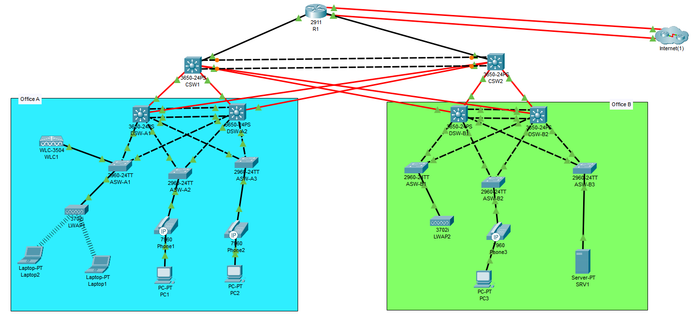

# **Abstract**

This project demonstrates the design and implementation of a three-tier enterprise network in Cisco Packet Tracer, connecting two branches via a Cisco 2911 router with redundancy for internet connectivity. The network is configured with OSPFv2 for dynamic IPv4 routing, and NAT for private IP address translation.

Security is a key focus, with SSHv2 for secure remote access, ACLs, DAI, DHCP Snooping, and Port Security for threat prevention. EtherChannel (LACP) is used for high-bandwidth, resilient connections between switches. DHCP and DNS services are configured for automatic IP allocation and name resolution.

Wireless LAN Controller (WLC) with WPA2+PSK ensures secure Wi-Fi connectivity. The network is monitored through NTP (with R1 as the server), SNMP, and centralized Syslog for logging.

This project integrates advanced networking concepts and ensures high availability, security, and scalability.

